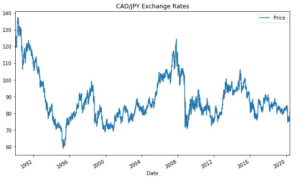
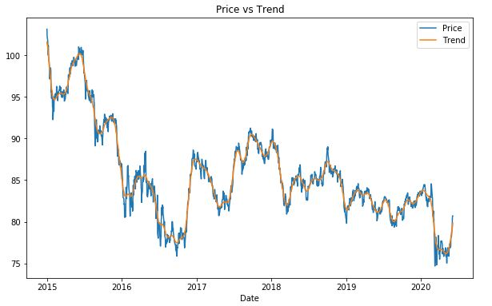
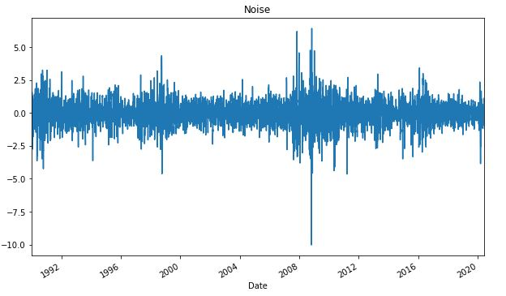
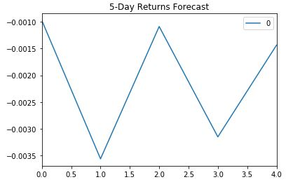
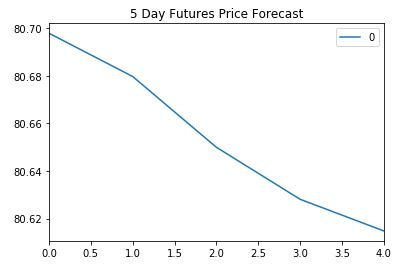
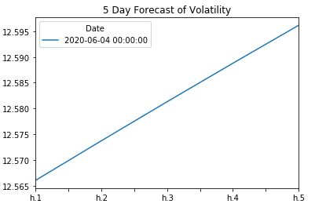

# A Yen for the Future

## Overview

In this assignment, time series tools were used to predict future movements of the Japanese yen vs the Canadian dollar.

### Time-series Forecasting

Based on the plot there is a lot of movement in the Japanese Yen vs the Canadian Dollar since 1992. Over time one can observe a weakening of the Yen vs the Canadian currency.

1. The **Hodrick-Prescott** filter was used to remove short-term fluctuations to understand the long-term trend in the exchange rate. The plots below show the decomposition between long-term trend vs exchange rate and short-term fluctuations.

   

   

2. **ARMA model**: Autoregressive Moving Average model was created  where AR(p) explains time series based on its own past values, that is, its own lags and MA(q) tries to capture the lagged forecast errors or the shock effects observed in the white noise terms. The order of 'p' and 'q' were set to (2,1).

   Based on the p-values generated in the model summary, p-values for AR(1) and MA(1) are 0 i.e they have a strong significance and hence a good fit whereas the AR(2) p-value of 0.14 is greater than the significance level of 0.05 which states that it is statistically not significant and keeping it can reduce the model's precision.
  

   The model was used to forecast 5-day returns. 

   

   
3. **ARIMA model**: Auto Regressive Integrated Moving Average models are applied where data shows evidence of non-stationarity, an initial differencing step (corresponding to the "integrated" part of the model) is applied one or more times to eliminate the non-stationarity. 

   In this model, ARIMA order was set as (5,1,1) where p(lag order) is 5, d(degree of differencing) is 1 and q(order of the moving avg) is 1.

   The ARIMA summary table shows that most of the p-values were greater than the significance level of 0.05 and therefore the model is considered less reliable. 

   The 5-day Forecast for the exchange rate of Yen shows a downward trend.

   

4. **GARCH**: Generalized Autoregressive Conditional Heteroskedasticity process is an approach to estimating volatility. It is an ARMA(p,q) model applied to the variance of a time series. The parameters for this model were set to the order of (2,1) i.e. p=2 and q=1. The GARCH model p-values were much lower than 0.05 except for alpha(2) indicating a better model performance.

   The 5 day forecast for annualized volatility shows an upward trend.

   

#### Analysis

1. Based on your time series analysis, would you buy the yen now?

   As per the time series analysis the futures price forecast for the Japanese Yen is showing a downward trend in the ARIMA model. This can be viewed as a buying opportunity to take advantage of an undervalued currency. But, one needs to keep in mind the rise in volatility as predicted by the GARCH model.

2. Is the risk of the yen expected to increase or decrease?

   The GARCH model shows increase in volatility hence there is an increase in expected risk related to the yen.

3. Based on the model evaluation, would you feel confident in using these models for trading?

   The p-values for GARCH model are relatively lower than the ARMA and ARIMA models suggesting that the GARCH model is a better fit and therefore more appropriate to use for trading.

### Linear Regression Forecasting

* Does this model perform better or worse on out-of-sample data compared to in-sample data?

The out of sample root mean squared error(RMSE) is lower than the in-sample root mean squared error. RMSE for training data should be lower than the RMSE for testing data.
